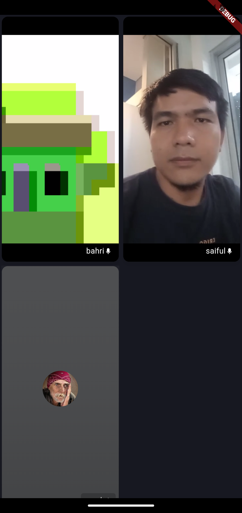
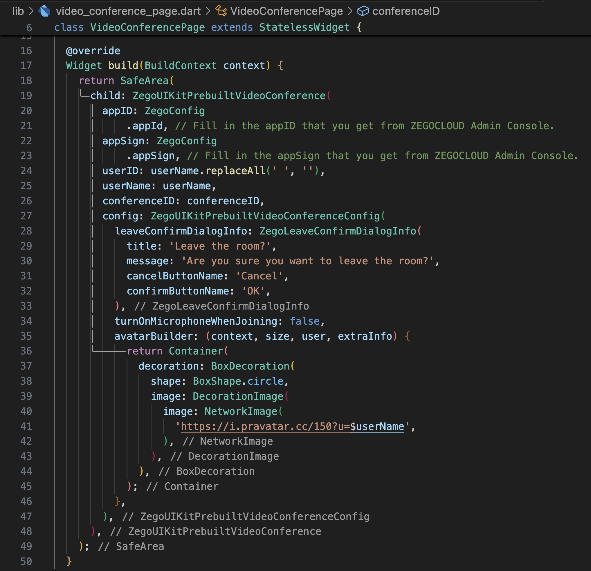

# flutter_video_conference_app

* Get 10000 free mins with UIKits: https://bit.ly/3DVtITl
* Learn more about ZEGOCLOUD: https://bit.ly/3BU2CLZ
* How to Build Flutter Video Conferencing Apps: https://bit.ly/4h4Qd6U

Flutter ZEGOCLOUD video conferencing API allows you to easily build your video conferencing apps within minutes. 

## Youtube Link

https://youtu.be/V0HrqyVuoZk

## ScreenShot

| Home        | Detail    |
|--------------|-----------|
|  |       |

## Contact:
* Consultation Flutter and Endorse https://wa.me/6285640899224
* Instagram: https://instagram.com/codewithbahri
* Linkedin: https://linkedin.com/in/bahrie
* Youtube: https://youtube.com/@codewithbahri
* Github: https://github.com/bahrie127
* Roadmap Flutter: https://youtu.be/e2zMJqDBmoY
* Medium: https://medium.com/@codewithbahri

